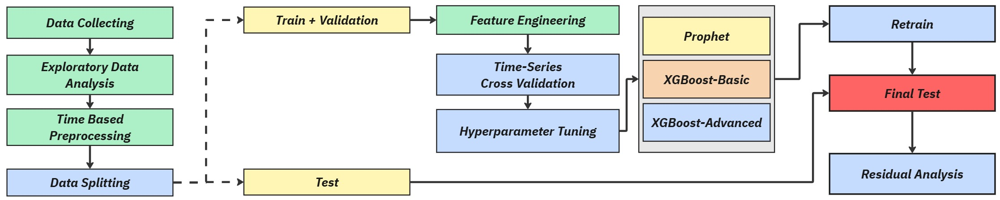

# NYC Taxi Hourly Trip Count Forecasting

Penelitian ini membandingkan pendekatan forecasting klasik dan machine
learning untuk memprediksi jumlah perjalanan taksi NYC per jam
(`trip_count`). Fokus utama penelitian adalah evaluasi metodologis yang
reproducible, bebas data leakage, dan sesuai dengan karakteristik deret waktu.

Model yang dibandingkan:

- Prophet
- XGBoost-Basic
- XGBoost-Advanced

Research questions (rumusan masalah) utama:

1. Apakah model machine learning sederhana, yaitu XGBoost-Basic, mampu
   mengungguli pendekatan forecasting klasik Prophet?
2. Apakah advanced feature engineering meningkatkan performa XGBoost pada
   forecasting permintaan taksi per jam?

## Diagram Alir Penelitian



Diagram di atas merangkum alur penelitian mulai dari data collection,
preprocessing berbasis waktu, feature engineering, time series cross
validation, hyperparameter tuning, eksperimen komparatif, hingga analisis
kesalahan.

## Ringkasan Metodologi

Dataset yang digunakan adalah NYC Taxi Dataset yang telah diagregasi menjadi
data hourly. Target forecasting adalah `trip_count`, yaitu jumlah perjalanan
taksi dalam setiap jam.

Konfigurasi utama penelitian:

| Komponen | Konfigurasi |
|---|---|
| Target variable | `trip_count` |
| Granularitas data | Hourly |
| Forecast horizon | 24 jam |
| Final test set | 30 hari terakhir |
| Cross validation | Expanding window |
| Validation horizon per fold | 168 jam |
| Jumlah fold | 5 |
| Metrics | MAE, RMSE, MAPE, sMAPE |
| Primary selection metric | MAE |
| Timezone modeling | UTC |
| Calendar feature timezone | America/New_York |

Prinsip validasi time series yang digunakan:

- Data tidak pernah di-shuffle.
- Final test set dipisahkan sejak awal dan tidak digunakan saat tuning.
- Hyperparameter tuning dilakukan dengan time series cross validation.
- Rolling features dibuat dari shifted target values.
- XGBoost dievaluasi menggunakan recursive forecasting, bukan prediksi
  langsung dari feature matrix validation atau test yang dapat mengandung
  informasi aktual masa depan.
- Actual validation/test hanya digunakan sebagai label evaluasi.

## Desain Eksperimen

### Experiment A: Prophet vs XGBoost-Basic

Eksperimen ini menjawab apakah model machine learning sederhana dengan fitur
lag dan calendar minimal dapat mengungguli Prophet yang memiliki pemodelan
trend dan seasonality internal.

Output utama:


### Experiment B: XGBoost-Basic vs XGBoost-Advanced

Eksperimen ini mengukur dampak advanced feature engineering terhadap performa
XGBoost. Perbandingan dilakukan antara feature set dasar dan feature set yang
lebih kaya, termasuk tambahan lag, rolling statistics, dan calendar features.

Output utama:


## Feature Sets

XGBoost-Basic menggunakan fitur minimal:

- Lag: `lag_1`, `lag_24`, `lag_168`
- Calendar: `hour`, `day_of_week`

XGBoost-Advanced menggunakan fitur tambahan:

- Lag: `lag_1`, `lag_2`, `lag_3`, `lag_6`, `lag_12`, `lag_24`, `lag_48`,
  `lag_72`, `lag_168`
- Rolling statistics: `rolling_mean_3`, `rolling_mean_24`,
  `rolling_mean_168`, `rolling_std_24`
- Calendar: `hour`, `day_of_week`, `is_weekend`, `month`

Rincian feature engineering tersedia di [FEATURE_SET.md](FEATURE_SET.md).

## Struktur Repository

```text
.
+-- assets/
|   +-- bdts_diagram_alir.jpg
+-- data/
|   +-- yellow_taxi_hourly_2025_2026_clean.csv
|   +-- processed/
+-- notebooks/
|   +-- 01_EDA.ipynb
+-- outputs/
|   +-- eda/
|   +-- experiments/
|   +-- logs/
|   +-- reports/
|   +-- splits/
+-- src/
|   +-- config.py
|   +-- data_loading.py
|   +-- preprocessing.py
|   +-- splits.py
|   +-- features.py
|   +-- forecasting.py
|   +-- metrics.py
|   +-- tracking.py
|   +-- models/
|   +-- experiments/
+-- AGENTS.md
+-- FEATURE_SET.md
+-- GUIDE.md
+-- PLAN.md
+-- RESEARCH_PIPELINE.md
+-- README.md
+-- pyproject.toml
+-- requirements.txt
```

## Quick Start

Panduan lengkap untuk menjalankan proyek dari fresh clone tersedia di
[GUIDE.md](GUIDE.md). Bagian ini hanya berisi eksekusi ringkas.

1. Clone repository dan masuk ke folder proyek.

```bash
git clone <repository-url>
cd <repository-folder>
```

2. Buat dan aktifkan virtual environment.

```bash
python -m venv .venv
.\.venv\Scripts\Activate.ps1
```

Untuk macOS/Linux:

```bash
python -m venv .venv
source .venv/bin/activate
```

3. Install dependencies.

```bash
pip install -r requirements.txt
```

4. Pastikan dataset tersedia pada path berikut.

```text
data/yellow_taxi_hourly_2025_2026_clean.csv
```

5. Jalankan pipeline utama.

```bash
python -m src.preprocessing
python -m src.splits
python -m src.features
python -m src.experiments.tune_prophet
python -m src.experiments.tune_xgb_basic
python -m src.experiments.tune_xgb_advanced
python -m src.experiments.experiment_a
python -m src.experiments.experiment_b
```

Untuk uji cepat dengan runtime lebih ringan, tuning dapat dibatasi:

```bash
python -m src.experiments.tune_prophet --max-parameter-sets 2 --skip-plots
python -m src.experiments.tune_xgb_basic --max-parameter-sets 3 --skip-plots
python -m src.experiments.tune_xgb_advanced --max-parameter-sets 3 --skip-plots
```

## Experiment Tracking dan Time Cost Computing

Setiap eksperimen dirancang untuk menyimpan:

- parameter eksperimen
- metrics per fold dan summary metrics
- prediction outputs
- plots
- metadata eksperimen
- training time
- prediction time
- total runtime

Logging runtime dipusatkan melalui [src/tracking.py](src/tracking.py) dan
disimpan di:

```text
outputs/logs/runtime_logs.csv
outputs/logs/experiment_runs.jsonl
```

## Dokumentasi Pendukung

- [GUIDE.md](GUIDE.md): panduan reproduksi dari fresh clone hingga eksperimen.
- [RESEARCH_PIPELINE.md](RESEARCH_PIPELINE.md): rincian alur metodologi
  penelitian.
- [FEATURE_SET.md](FEATURE_SET.md): daftar fitur untuk XGBoost-Basic dan
  XGBoost-Advanced.
- [PLAN.md](PLAN.md): rencana implementasi dan tracking progress proyek.
- [AGENTS.md](AGENTS.md): aturan kerja proyek dan leakage prevention checklist.

## Reproducibility Notes

Penelitian ini menerapkan beberapa guardrail untuk menjaga validitas hasil:

- Seluruh konfigurasi global disentralisasi di [src/config.py](src/config.py).
- Random seed didefinisikan secara eksplisit.
- Split data dilakukan berdasarkan waktu.
- Final test set tidak digunakan pada proses tuning dan eksperimen CV.
- XGBoost validation menggunakan recursive forecasting 24 jam.
- Output eksperimen disimpan dalam struktur folder yang konsisten.

## Citation and Attribution
- Wildan Abid Al H
- Iga Sena H
- Nabila Putri A
- Vivian Aileen H
> Proyek ini disusun sebagai penelitian forecasting berbasis NYC Taxi hourly trip count. Jika repository ini digunakan sebagai referensi akademis atau praktikum, sertakan atribusi terhadap proyek dan dokumentasikan perubahan metodologi yang dilakukan.